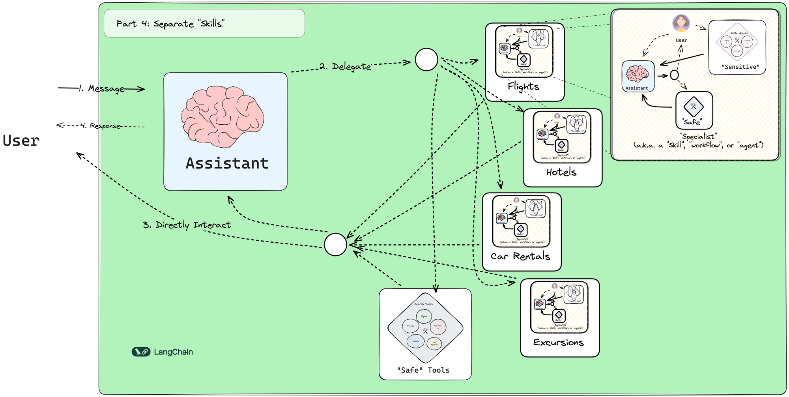

# 🤖 LangGraph Customer Support Bot

A sophisticated customer support chatbot for airlines built with LangGraph and LangChain, designed to handle flight bookings, hotel reservations, car rentals, and excursion planning.

## 📝 Description

This repository contains a step-by-step implementation of a customer support bot for an airline, demonstrating how to use LangGraph's advanced features to create a robust conversational AI system. The bot can help users research and make travel arrangements, including flight bookings, hotel reservations, car rentals, and excursion planning.

The implementation progresses through four increasingly sophisticated architectures, showcasing different LangGraph concepts and design patterns:

1. **Zero-shot Agent**: A simple implementation with all tools available to a single agent
2. **Confirmation Agent**: Adding user confirmation before executing tools
3. **Conditional Interrupt**: Categorizing tools as safe (read-only) or sensitive (data-modifying)
4. **Specialized Workflows**: Creating dedicated sub-graphs for different user intents



## ✨ Features

- **Flight Management**: Search for flights, update bookings, and cancel tickets
- **Hotel Reservations**: Search for hotels and manage bookings
- **Car Rentals**: Find and book rental cars at destinations
- **Excursion Planning**: Discover and book local activities and attractions
- **Policy Lookup**: Access airline policies and FAQs to answer customer questions
- **User Confirmation**: Request user approval before making changes to bookings
- **Specialized Assistants**: Route queries to domain-specific assistants for better responses

Each assistant has access to specific tools relevant to its domain, and sensitive operations require explicit user confirmation before execution.

## 🛠️ Prerequisites

- Python 3.8+
- An Anthropic API key (for Claude models)
- A Tavily API key (for web search capabilities)

## 🚀 Setup Guide

1. Clone the repository:
   ```bash
   git clone https://github.com/corticalstack/langgraph-customer-support-bot.git
   cd langgraph-customer-support-bot
   ```

2. Install the required dependencies:
   ```bash
   pip install -r requirements.txt
   ```

3. Set up your API keys:
   - Create environment variables for `ANTHROPIC_API_KEY` and `TAVILY_API_KEY`
   - Or enter them when prompted by the notebook

4. Run the Jupyter notebook:
   ```bash
   jupyter notebook customer-support.ipynb
   ```

## 🧠 Key LangGraph Concepts Demonstrated

- **StateGraph**: Managing complex conversation state
- **Interrupts**: Pausing execution to get user confirmation
- **Checkpointers**: Persisting state between interactions
- **Conditional Edges**: Routing based on user intent and tool usage
- **Tool Nodes**: Executing actions based on LLM decisions
- **Dialog State Management**: Tracking which assistant is active

## 📊 Database Schema

The assistant uses a SQLite database with the following main tables:
- `flights`: Flight information including schedules and status
- `tickets`: User ticket information
- `hotels`: Hotel listings and availability
- `car_rentals`: Car rental options
- `trip_recommendations`: Excursion and activity suggestions

## 🔍 Usage Examples

The notebook includes example conversations demonstrating how the bot handles various user requests:

- Checking flight information
- Updating flight bookings
- Finding and booking hotels
- Renting cars
- Discovering and booking excursions

## 📚 Resources

- [LangGraph Documentation](https://langchain-ai.github.io/langgraph/)
- [LangChain Documentation](https://python.langchain.com/docs/)
- [LangSmith for Evaluation](https://docs.smith.langchain.com/evaluation)

## 📄 License

This project is licensed under the MIT License - see the LICENSE file for details.
